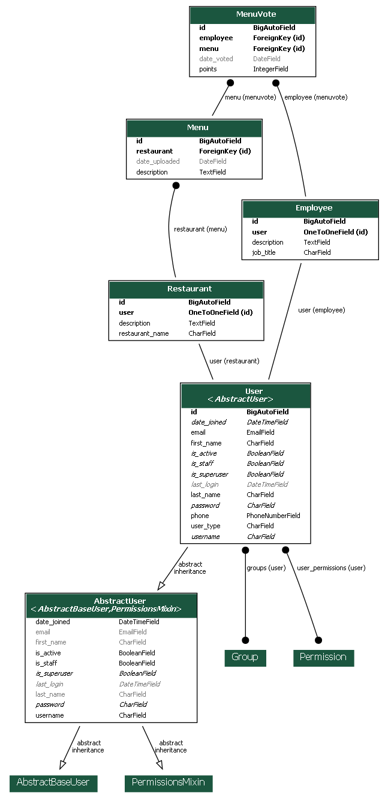
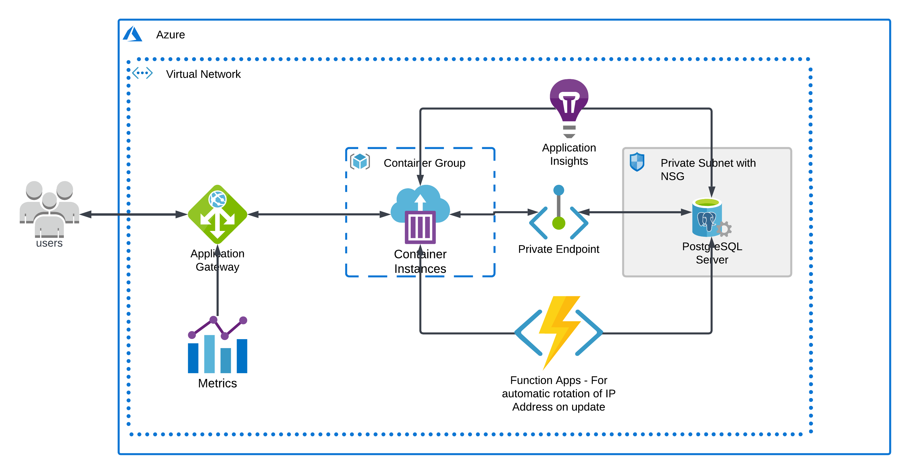

# Lunch Poll Service
An internal service for making decision on which Restaurant to visit for lunch in a company.

https://lucid.app/lucidchart/9ffcb158-b736-4344-aeef-d56f17640e77/edit?invitationId=inv_2b7384da-ad02-4b90-bf94-1b3e5ac64b5e#

## Project Overview

This project is a service for Employees (workers) within an organisation to vote food menus for decision of a place (Restaurant) to go for Lunch. The project builds to a [docker image](https://hub.docker.com/repository/registry-1.docker.io/nolwac/lunch-poll-service/general) which can easily be deployed as a microservice in Kubernetes or Docker, using a **YAML** configuration file and/(or only) **kubectl or docker** command line utility respectively.

### Architecture
The schema diagram of the database, generated using **django_extensions** is as shown below:



The Infrastructure diagram for deployment to *Azure Container Instance* might be as shown below.



Once the project is running, the endpoint **/api/[version]/docs/swagger/** to view the API docs and interact with it.

## How it works
A user account on the platform (Lunch Poll service) is either an *employee*(Employee model) type account or *restaurant* (Restaurant model) type account. As can be seen from the Database schema diagram above the 2 is related to the *User* model by a one to one relationship. Based on the implementation on the *User* model, it's not possible for a *User* instance to have reference to it from both *Restaurant* and *Employee* model instances.

By this way it is ensured that a user can not be both an *employee* type user and *restaurant* type user at same time.
The implementation makes sure that only *restaurant* type user can create a *Menu* instance and that only an *employee* type user can vote a menu (i.e, create a *Vote* instance).

Menus to be voted for are Menus uploaded on the particular day of voting, this is achieved by adding *uploaded_date* field to *Menu* so that the implementation can validated if it is eligible for voting or not. The *employee* type user who is allowed to vote only a single *Menu* instance per day for the first version of the API and up to 3 *Menu* instances per day for the second version of the API.

API versioning is *URL* based versioning as can be seen from the *OpenAPI* based docs provided at this endpoint **/api/[version]/docs/swagger/**. For version 1, the API routes traffic to an API view which checks the vote counts that day by the requesting user (employee type). If the count is less than 1 (i.e, 0), then it allows then it implements the vote request for that user. But if the count is greater than 3, it will return a forbidden status code defining that the user is not allowed to vote for more than 1 *Menu* instance.

For the version 2, the restricting number of votes is 3, hence, a user can continue voting for more *Menu* instances upto a count of 3, after which the user will be forbidden to vote again for that day. Points are associated to votes for the version 2. default point for version 1 is 1. But version 2 allows the user right to vote minimum of point of 1 and maximum point of 3 for a particular *Menu* instance.

An endpoint exposes the winning *Menu* based on the summation of the vote count with respect to the points accumulated by each *Menu* per vote.
The *Menu* instance with the highest value of summation{vote.point} wins the selection. Hence for that day, the restaurant that created that *Menu* becomes the winning restaurant for lunch.

## Running the Service

The project contains a *scripts* directory which is made up of command line utilities for setting up development environment, running building the project to a docker image and uploading the image to docker hub.
**Note**: *it is reccommended that you run the project on a linux system or pull the image from docker hub to run in Kubernetes or Docker. You may as well follow the steps discussed later in this docs to build the docker image yourself.*

If your interest is to play around with the project, to develope custom features around what is already existing, then you might want to run the development environment setup scripts to setup the development environment up and running.

**Every commands listed here should be executed from the project's root directory** 

### Setup development environment and run the project
To setup the project running for development, navigate to the project directory and run the setup script as shown below:

**Warning**: Look into *main/settings/production.py* for environment variables that you need to set for the project to run properly.
Alternatively, since this is development environment setup, then you might have to create a settings file with name *local.py*, inside *main/settings* and put the following minimal content into it before you proceed to run the setup commands.
```python
"""
This file has been added to gitignore so as to differentiate between local development settings and production settins.

The main settings file is base.py, which this file and prouction.py file imports from.
On runtime settings.__init__.py tries to import definitions in local.py, if the import fails, it falls back to production.py, this explains why adding this file automatically makes the settings defined here the default settings for development.
"""
from .base import *

```
**Proceed to run the setup command:**

*for Windows*
```shell
scripts\setup.bat lunch_poll
```

*for Linux*
```shell
bash scripts/setup.sh lunch_poll
```
*lunch_poll*, is the desired name for the virtual environment to be created when setting up the development environment.
**Note**: you are free to use any name of your choice instead of *lunch_poll*, just make sure to remember it.

Once the project development environment setup is done and the virtual environment is fully setup and functional, run the following command on the project directory to spin up the server.

```shell
python manage.py runserver
```

### Activating virtual environment
In case you exit the terminals and want to have them working again, then you might want to activate the virtual environment before running the project.

Run the following command to activate the virtual environment at any point.

```shell
workon lunch_poll
```
*Note:* The virtual enviroment must always be active for the server to run or for the test runner and precommit functionalities to work.

### Running tests

To run tests, execute the command on the root directory

```shell
python manage.py test
```

### Running code formatter (black)

**Black** is the code formatter used, to run the code formatter, execute the following command on the root directory.

```shell
black .
```

### Running code linter (flake8)

The code linter used in this project is **flake8**, to run the code linter, execute the command below.

```shell
flake8
```

### Running static type checker (mypy)

The static type checker used in this project is **mypy**, to run the type checker, execute the command below.

```shell
mypy .
```

*Note:* Your changes must pass all these test before you can successfully make a commit.

## Running with Docker
First you have to make sure that you have docker installed and running, then run the *build_image.sh* bash script as below:

*Windows*
```shell
scripts\build_image.bat lunch-poll-service
```

*Linux*
```bash
bash scripts/build_image.sh lunch-poll-service
```
*lunch-poll-service* is the *tag* for the image after it's built.
The above command builds the image and run a container from the image, if your desired feature is to run an existing image then, you might want to run the following command instead.

```bash
docker run -p 8000:80 nolwac/lunch-poll-service
```
You may have to do this as a root user for this to work.
